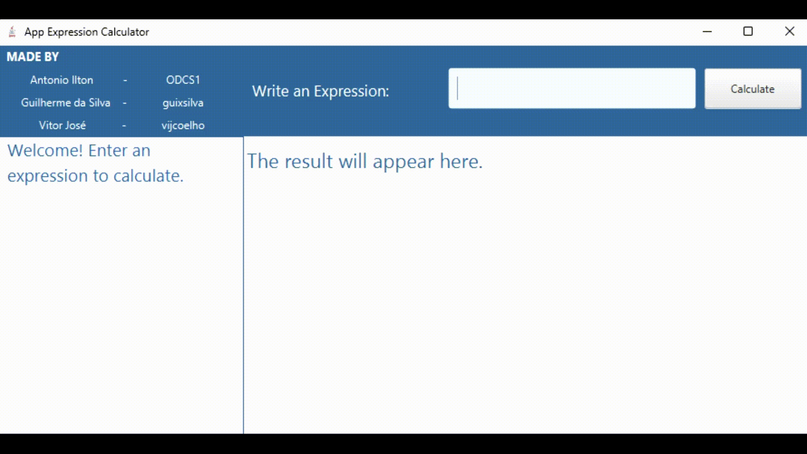
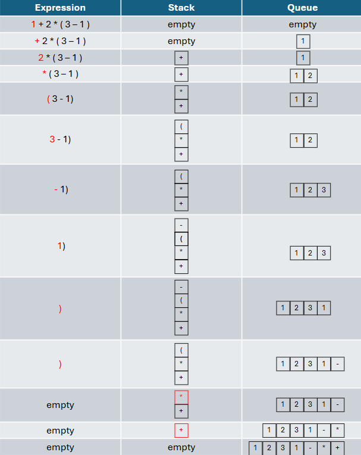
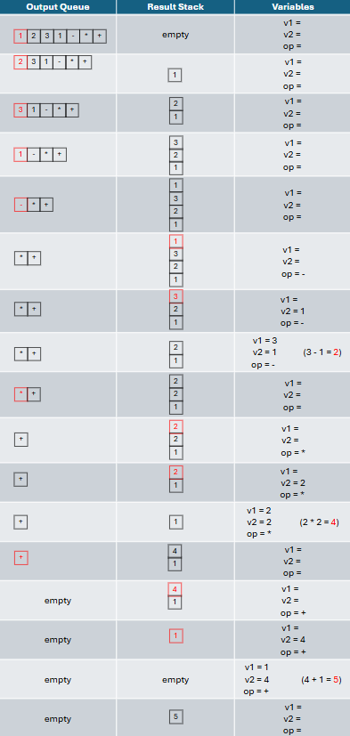

# Expression App Calculator


The purpose of this project is to create a calculator that deviates from the standard approach commonly found, where arithmetic operators are applied sequentially (taking the result of the previous calculation and performing the next operation).

This project aims to build a calculator that can evaluate numerical expressions entered by the user through a graphical interface, providing the result or error messages when applicable. To achieve this, the method developed by Polish mathematician Jan Łukasiewicz was used, which evaluates expressions without the need to worry about operation priorities. This method includes the following three concepts:

- **Infix**: Operator is placed between operands (e.g., `4 - 3`).
- **Prefix**: Operator precedes the operands (e.g., `- 4 3`).
- **Postfix**: Operator follows the operands (e.g., `4 3 -`).

<br>

This implementation uses queues, stacks, and linked lists (though the latter is not strictly necessary). The technique involves converting the user's input expression (in infix notation) to postfix notation (storing elements in a stack and moving them to a queue according to the rules outlined in [Rules](#rules)), and then calculating the value of the expression from the queue.

<br>
<div style="max-width: 800px; margin: 0 auto;">
  
</div>

---

## Operators and Precedence
To ensure calculations are performed correctly, inputs must follow the correct syntax. The operators and their precedence levels align with those commonly used in programming and mathematics.

<table border="1" cellspacing="0" cellpadding="5">
    <caption>Accepted Operators</caption>
    <thead>
        <tr>
            <th>Symbol</th>
            <th>Meaning</th>
        </tr>
    </thead>
    <tbody>
        <tr>
            <td>+</td>
            <td>Addition</td>
        </tr>
        <tr>
            <td>-</td>
            <td>Subtraction</td>
        </tr>
        <tr>
            <td>*</td>
            <td>Multiplication</td>
        </tr>
        <tr>
            <td>/</td>
            <td>Division</td>
        </tr>
        <tr>
            <td>^</td>
            <td>Exponentiation</td>
        </tr>
        <tr>
            <td>()</td>
            <td>Parentheses</td>
        </tr>
    </tbody>
</table>
<br>
<table border="1" cellspacing="0" cellpadding="5">
    <caption>Order of Precedence</caption>
    <thead>
        <tr>
            <th>Symbol</th>
            <th>Meaning</th>
            <th rowspan="6">Precedence</th>
        </tr>
    </thead>
    <tbody>
        <tr>
            <td>()</td>
            <td>Parentheses</td>
            <td rowspan="6" style="text-align: center; vertical-align: middle;">
            
        </td>
        </tr>
        <tr>
            <td>^</td>
            <td>Exponentiation</td>
        </tr>
        <tr>
            <td>*</td>
            <td>Multiplication</td>
        </tr>
        <tr>
            <td>/</td>
            <td>Division</td>
        </tr>
        <tr>
            <td>+</td>
            <td>Addition</td>
        </tr>
        <tr>
            <td>-</td>
            <td>Subtraction</td>
        </tr>
    </tbody>
</table>

---

## Infix to Postfix

To convert an infix expression to postfix, specific rules must be followed. One important case involves evaluating the operators in the sequence of the expression compared to the top of the stack. The table below indicates whether the current operator should be pushed onto the stack or whether the top of the stack should be popped into the queue before inserting the new operator.

<div style="display: flex; justify-content: center; margin-bottom: 30px">
    <table border="1" cellspacing="0" cellpadding="5">
        <thead>
            <tr>
                <th rowspan="2">Operator at Stack Top</th>
                <th colspan="7">Operator from Sequence</th>
            </tr>
            <tr>
                <th>(</th>
                <th>^</th>
                <th>*</th>
                <th>/</th>
                <th>+</th>
                <th>-</th>
                <th>)</th>
            </tr>
        </thead>
        <tbody>
            <tr>
                <td style="text-align: center;">(</td>
                <td>F</td>
                <td>F</td>
                <td>F</td>
                <td>F</td>
                <td>F</td>
                <td>F</td>
                <td>T</td>
            </tr>
            <tr>
                <td style="text-align: center;">^</td>
                <td>F</td>
                <td>F</td>
                <td>T</td>
                <td>T</td>
                <td>T</td>
                <td>T</td>
                <td>T</td>
            </tr>
            <tr>
                <td style="text-align: center;">*</td>
                <td>F</td>
                <td>F</td>
                <td>T</td>
                <td>T</td>
                <td>T</td>
                <td>T</td>
                <td>T</td>
            </tr>
            <tr>
                <td style="text-align: center;">/</td>
                <td>F</td>
                <td>F</td>
                <td>T</td>
                <td>T</td>
                <td>T</td>
                <td>T</td>
                <td>T</td>
            </tr>
            <tr>
                <td style="text-align: center;">+</td>
                <td>F</td>
                <td>F</td>
                <td>F</td>
                <td>F</td>
                <td>T</td>
                <td>T</td>
                <td>T</td>
            </tr>
            <tr>
                <td style="text-align: center;">-</td>
                <td>F</td>
                <td>F</td>
                <td>F</td>
                <td>F</td>
                <td>T</td>
                <td>T</td>
                <td>T</td>
            </tr>
            <tr>
                <td style="text-align: center;">)</td>
                <td>F</td>
                <td>F</td>
                <td>F</td>
                <td>F</td>
                <td>F</td>
                <td>F</td>
                <td>F</td>
            </tr>
        </tbody>
    </table>
</div>

Some rules for moving elements between the operator stack and the output queue are as follows:

1. If the current token is `(`, push it onto the operator stack.
2. If the current token is a number, enqueue it into the output queue.
3. If the current token is an operator (`+`, `-`, `*`, `/`, `^`):
    - Check whether any operators should be removed from the stack, using the table above as a guide:
        - If the table value is `T` (true), pop the stack and enqueue the element.
        - If the value is `F` (false), skip popping and proceed to the next step.
        - Repeat until the top of the stack evaluates to `F`.
    - Push the current operator onto the stack.
4. If the current token is `)`, pop elements from the stack and enqueue them until encountering `(`, which should be discarded.

The process ends when the stack is empty, and all elements are in the output queue (excluding parentheses).

### Infix to Postfix Example

Input: `1 + 2 * (3 - 1)`


<br>
Postfix expression in the output queue: ['1', '2', '3', '1', '-', '*', '+']

---
## Calculate Postfix Expression
In this step, you will need two variables, such as "v1" and "v2", to store the numerical values of the current operation, and to store the operator, you will need to create a variable like "op".

To remove an element from the output queue, you must verify and follow the following rules:

1. If the element is a numerical value, push it onto the Result Stack. Repeat this step until the element removed from the Output Queue is an operator.

2. If the element removed from the Output Queue is an operator, store it in the char variable defined as `op`.

    - Don't stop there... When encountering a logical operator and after storing it in `op`, pop one element (which must be a numeric string), convert it to a number, and store it in `v2`. Then, pop another element (which must also be a numeric string), convert it to a number, and store it in `v1`. Next, calculate the result of the expression: `v1 op v2`. This result should be stored in the Result Stack.

3. Done! If there are still elements in the Output Queue, you must apply the general rule again (return to step 3.2). If there are no elements left in the Output Queue, there should be a single element in the Result Stack, which will be the final result of the expression.

4. At the end of step 3, you will have the final result of the expression, which is the expected output of the program. See the application of these steps below for the example:



The final result is always the single element in the stack, considering that the queue is empty and there are no operations in progress.

---

## How to use it

1. Clone the repository:
    ```
    git clone https://github.com/ODCS1/Expression-Calculator.git
    ```
2. Change Directory:
    ```
    cd Expression-Calculator
    ```
3. Install dependencies:
 ```
 mvn install
 ```
4. Run the application:
In the IDE, run the file `MainApp.java`.

Or, build the application to generate the .jar file, navigate to the folder where the .jar file was generated, and execute:
 ```
 java -jar Expression-Calculator.jar
 ```

## Contributors

<div>
 <a href="https://github.com/ODCS1">
     
 </a>
 <a href="https://github.com/guixsilva">
     
 </a>
 <a href="https://github.com/vijcoelho">
     
 </a>
</div>
Made with [contrib.rocks](https://contrib.rocks).
